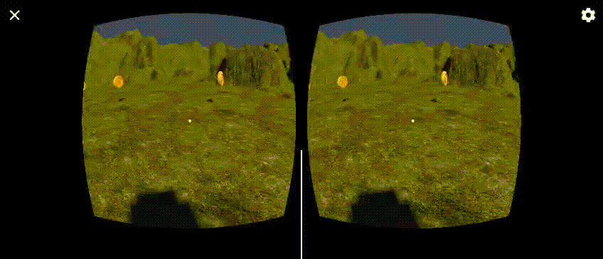

# Práctica 5 Interfaces Inteligentes
## Curso: 2025-2026
### Salvador González Cueto

---

## Apartado 2

Se ha copiado el objeto `player` de la escena de ejemplo que viene en el paquete cardboard. Al objeto se le han añadido los scripts [MovePosition.cs](src/MovePosition.cs) para desplazar al personaje con un mando y el script [CollectCoins.cs](src/CollectCoins.cs) para recolectar monedas.

---

## Apartado 3

Se ha creado un cubo que contiene el script [CollectAllNotifier.cs](src/CollectAllNotifier.cs) que activa un evento cuando el puntero de las cardboard le mira. A las monedas se les ha creado el script [CollectAllObserver.cs](src/CollectAllObserver.cs) que observan al cubo y cuando este dispara el evento, se desplazan hacia el jugador.

---

## Vista desde el móvil

Se ha compilado el programa para utilizarlo en dispositivos móviles con un mando conectado por bluetooth.

