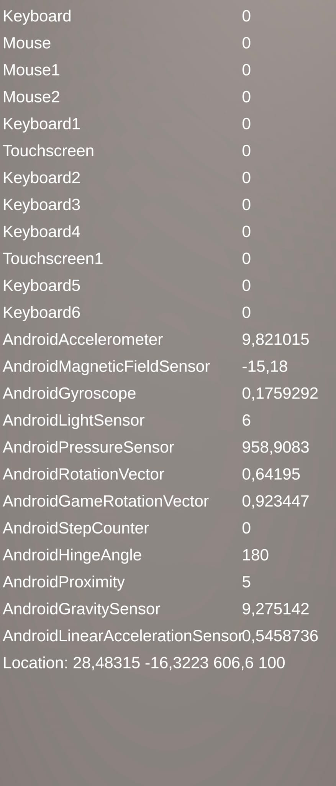

# Práctica Sensores Interfaces Inteligentes
## Curso: 2025-2026
### Salvador González Cueto

---

## Apartado 1

Se ha creado el script [Sensors.cs](src/Sensors.cs) con el que se obtienen todos los sensores del dispositivo, se habilitan y se obtienen el nombre y sus datos, también obtiene la localización.

## Apartado 2

Se ha creado el script [MoveSensor.cs](src/MoveSensor.cs) con el que se obtiene el acelerómetro y se mueve un guerrero en base a los valores que toma el acelerómetro.

