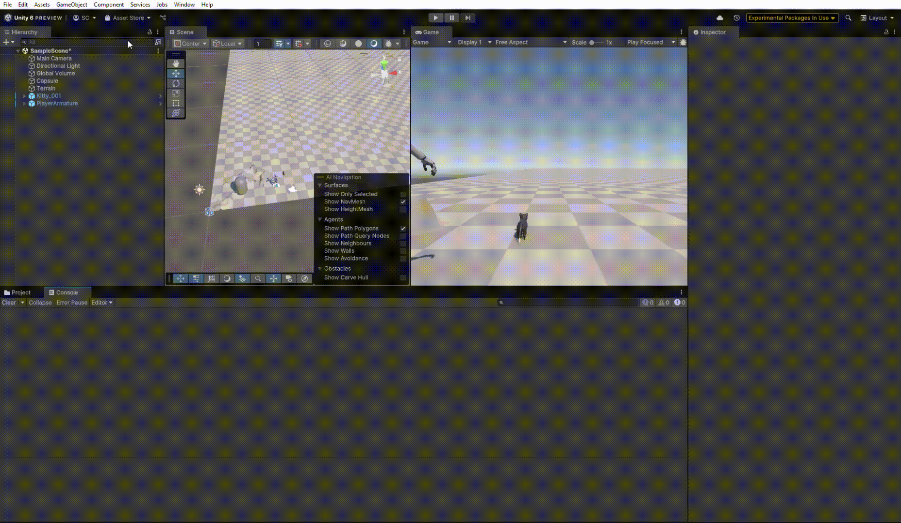

# Práctica 1 Interfaces Inteligentes
## Curso: 2025-2026
### Salvador González Cueto

Para completar la escena que se muestra en el siguiente gif:

Se han realizado los siguientes pasos:
* Crear un objeto 3D capsule.
* Descargar e importar los assets del paquete [starter assets third person](https://assetstore.unity.com/packages/essentials/starter-assets-thirdperson-updates-in-new-charactercontroller-pa-196526).
* Generar un terreno desde el panel de objetos 3D, y realizar ciertas modificaciones sobre este.
* Colocar un prefab de el paquete mencionado anteriormente en escena.
* Descargar, importar y colocar un asset del paquete [Animals FREE - Animated Low Poly 3D Models](https://assetstore.unity.com/packages/3d/characters/animals/animals-free-animated-low-poly-3d-models-260727).
* Añadir etiquetas a todos los objetos añadidos y previamente generados por el propio Unity.
* Crear el script [mostrar_tag_y_position.cs](./mostrar_tag_y_position.cs) para mostrar una única vez el tag del objeto y la posición de este.
