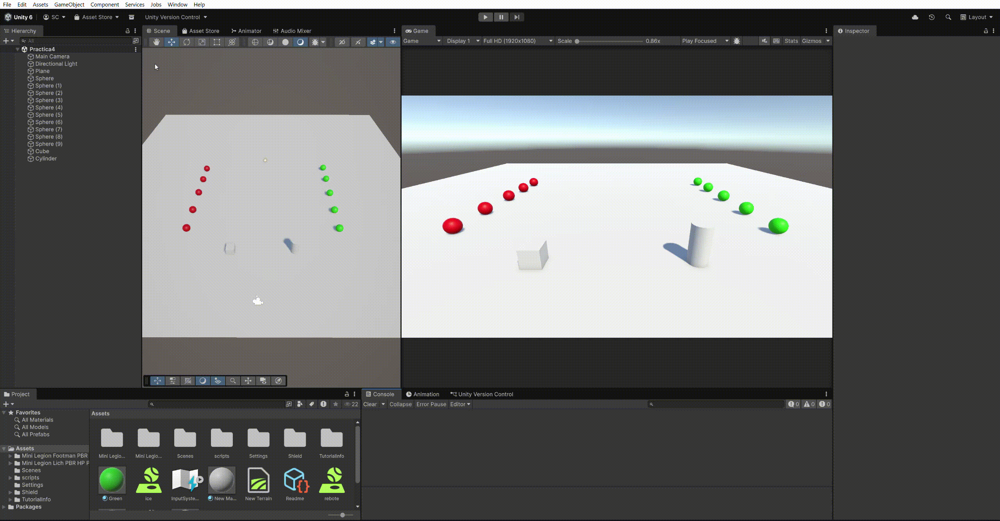
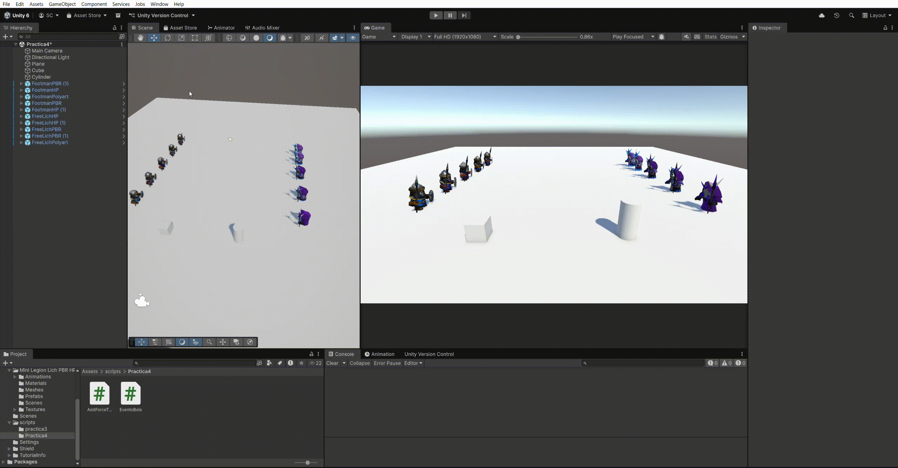
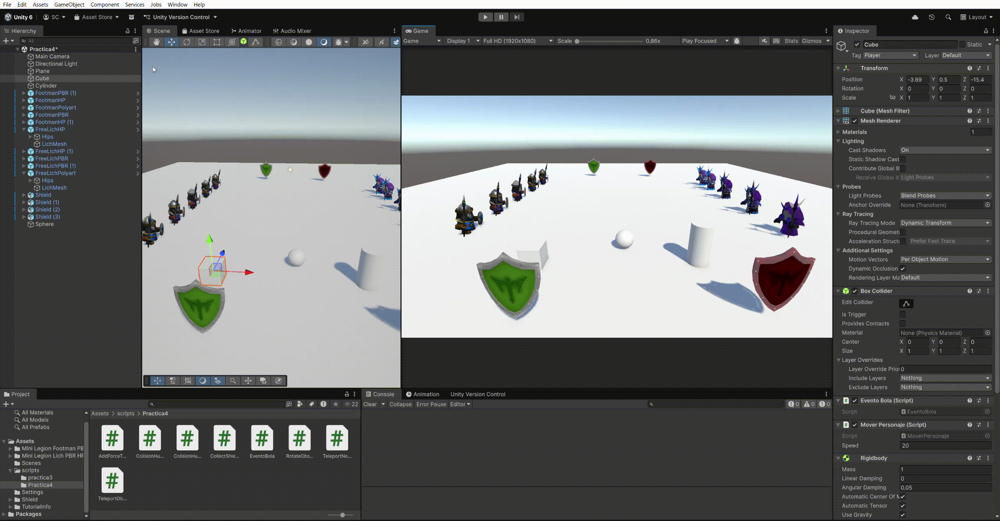
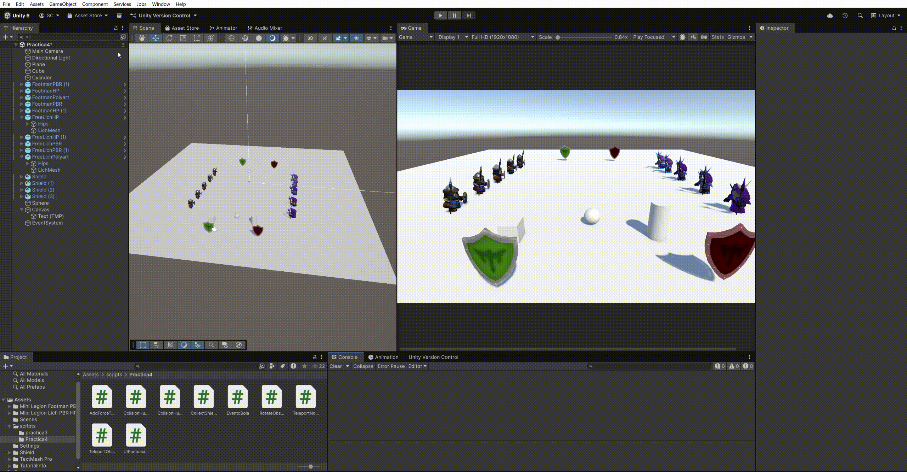
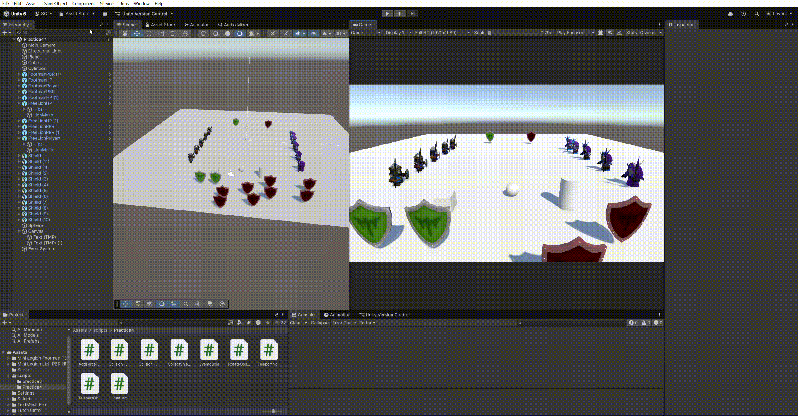

# Práctica 4 Interfaces Inteligentes
## Curso: 2025-2026
### Salvador González Cueto

---

## Apartado 1

[ref](src/ref).

---

## Apartado 2

[ref](src/ref).

---

## Apartado 3

[ref](src/ref).

---

## Apartado 4

[ref](src/ref).

---

## Apartado 5

[ref](src/ref).

---

## Apartado 6

[ref](src/ref).

---

## Apartado 7

[ref](src/ref).
