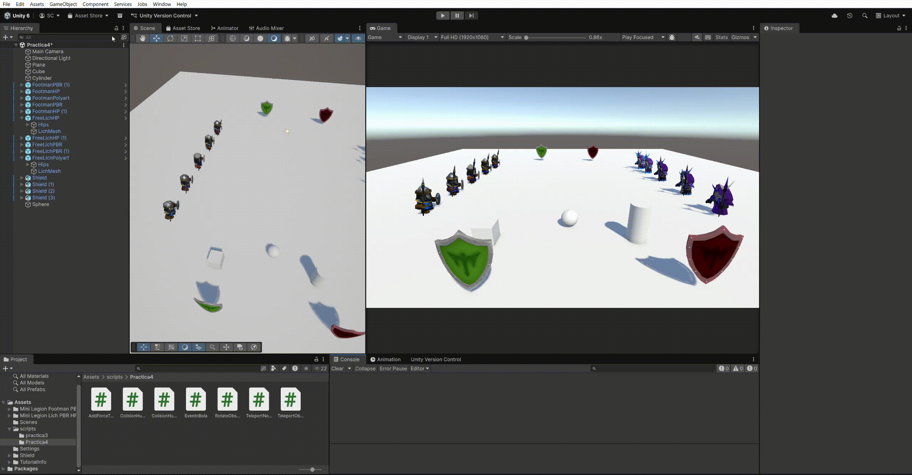

# Práctica 4 Interfaces Inteligentes
## Curso: 2025-2026
### Salvador González Cueto

---

**NOTA**: Todos los objetos utilizados son físicos (Apartado 9).

---

## Apartado 1

Se han creado los siguientes scripts:
- [EventoBola.cs](src/EventoBola.cs): Tiene un evento que se activa al colisionar con el cilindro.
- [AddForceTowards.cs](src/AddForceTowards.cs): Tiene un observer a EventoBola que suscribe una función que añade una fuerza al objeto hacia un objeto dado por referencia.

---

## Apartado 2

Se han modificado los objetos para utilizar los assets especificados.

---

## Apartado 3

Se han creado los siguientes scripts:
- [ColisionHuman.cs](src/ColisionHuman.cs): Tiene dos eventos que se activan al colisionar con un humano en base a su tipo.
- [ColisionHumanObserver.cs](src/ColisionHumanObserver.cs): Tiene un observer a CollisionHuman que suscribe dos funciones que añade una fuerza al objeto hacia un escudo dado por referencia en base a la función.

---

## Apartado 4

Se han creado los siguientes scripts:
- [TeleportNotifier.cs](src/TeleportNotifier.cs): Tiene un evento que se activa cuando el jugador se acerca.
- [TeleportObserver.cs](src/TeleportObserver.cs): Tiene un observer a TeleportNotifier que suscribe una función que modifica la posición del objeto para que sea igual que otro objeto dado por referencia.
- [RotateObserver.cs](src/RotateObserver.cs): Tiene un observer a TeleportNotifier que suscribe una función que modifica la rotación del objeto para que mire a otro objeto dado por referencia.

---

## Apartado 5

Se ha creado el siguiente script:
- [CollectShields.cs](src/CollectShields.cs): Cuando el objeto colisiona con un escudo, desactiva el escudo, incrementa la puntuación y la muestra en base al tipo.

---

## Apartado 6

Se ha modificado el siguiente script:
- [CollectShields.cs](src/CollectShields.cs): Tiene un evento que se activa cuando la puntuación cambia, y pasa la puntuación por referencia.

Se ha creado el siguiente script:
- [UIPuntuacion.cs](src/UIPuntuacion.cs): Tiene un observer a CollectShields que suscribe una función que modifica un texto en canvas para mostrar la puntuación.

---

## Apartado 7

Se ha modificado el siguiente script:
- [UIPuntuacion.cs](src/UIPuntuacion.cs): Tiene una nueva función que muestra un texto en canvas cada vez que se obtienen 100 puntos.
