# Práctica 3 Interfaces Inteligentes
## Curso: 2025-2026
### Salvador González Cueto

## Situaciones
### Situación 1

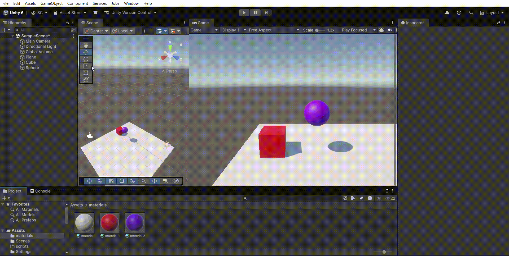

En este caso no podemos observar ningún movimiento al comenzar a jugar, pues el único objeto con rigidbody se encuentra inmediatamente encima del plano.

---

### Situación 2

En este caso podemos observar como la esfera cae sobre el plano con la gravedad que le proporciona por defecto el rigidbody.

---

### Situación 3

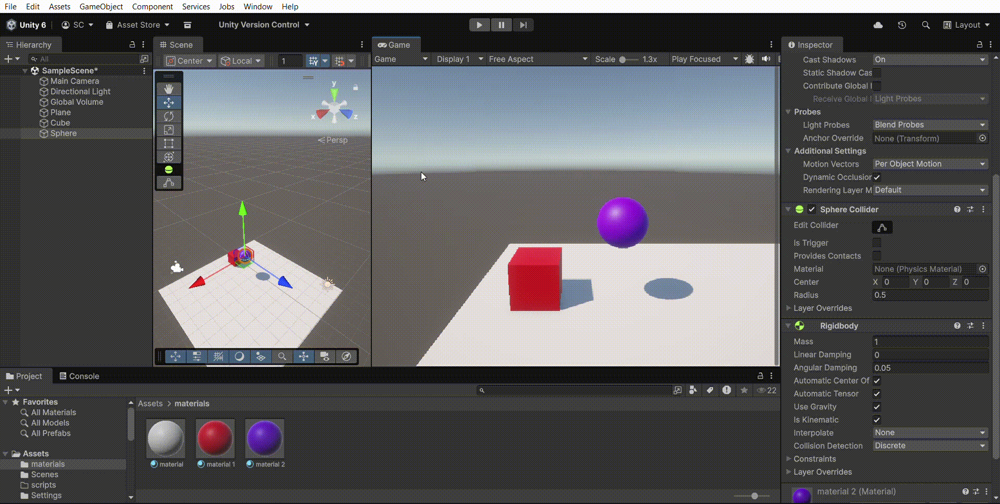

En este caso la esfera no cae pues es cinemática, pero dispone de ciertas físicas por el rigidbody.

---

### Situación 4

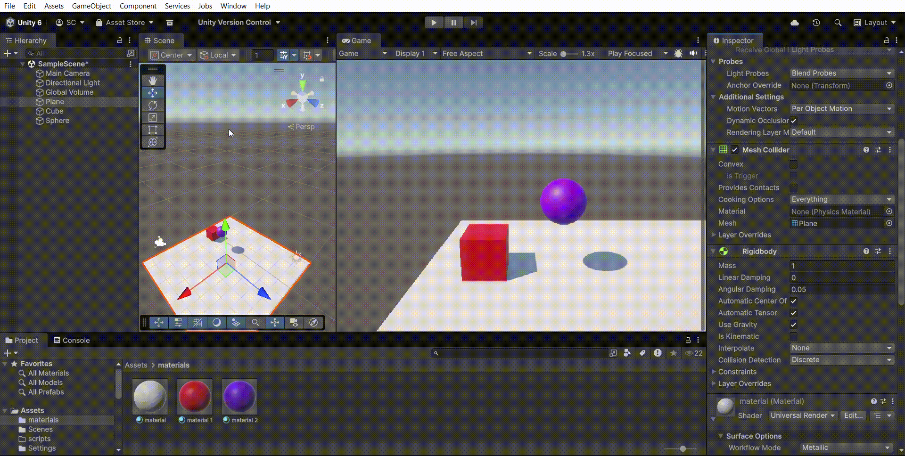

En este caso todos los objetos caen al vacío por la gravedad.

---

### Situación 5

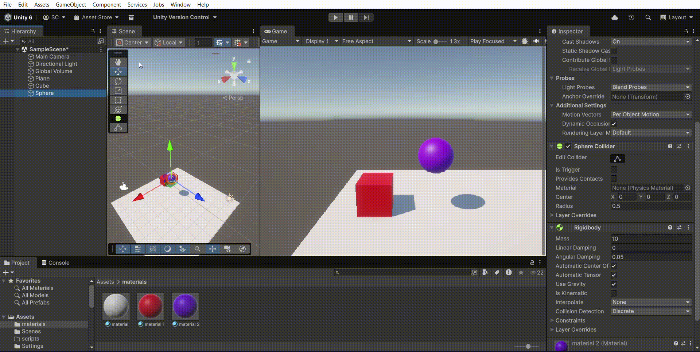

Al modificar la masa de la esfera, no afecta a la velocidad a la que caen los objetos, pues la masa no afecta a la velocidad de los objetos que no tienen fricción.

---

### Situación 6

Mismo caso que la situación anterior.

---

### Situación 7

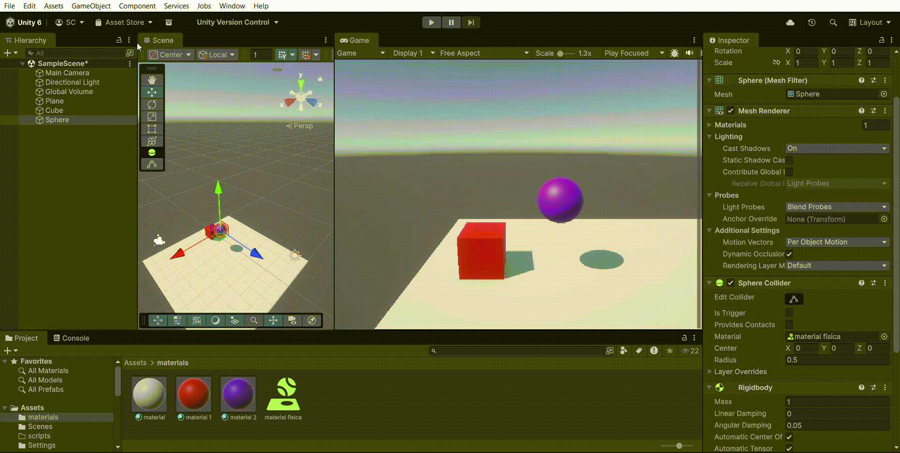

Podemos observar como ligeramente la esfera cae algo más lento que el resto de objetos.

---

### Situación 8

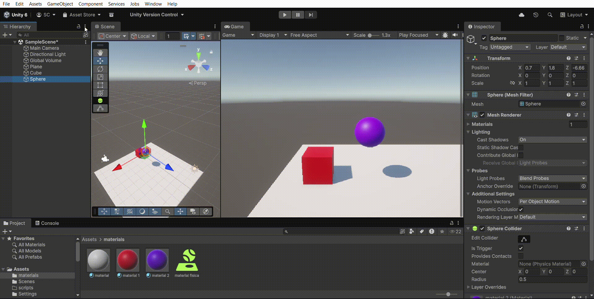

En este caso la esfera no tiene colisión física, pues al activar el is Trigger, se comporta como un activador sin físicas.

---

### Situación 9

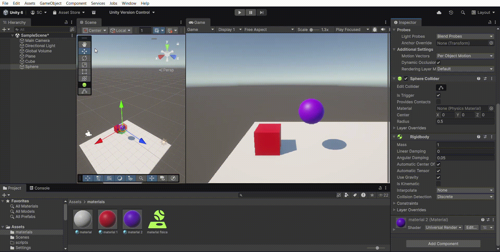

A pesar de tener un rigidbody, en este caso ocurre lo mismo de la situación anterior.

---

## Ejercicios scripts
### Ejercicio 1

Se ha creado el script [MoverPersonaje.cs](src/MoverPersonaje.cs) para desplazar al personaje utilizando rigidbody.

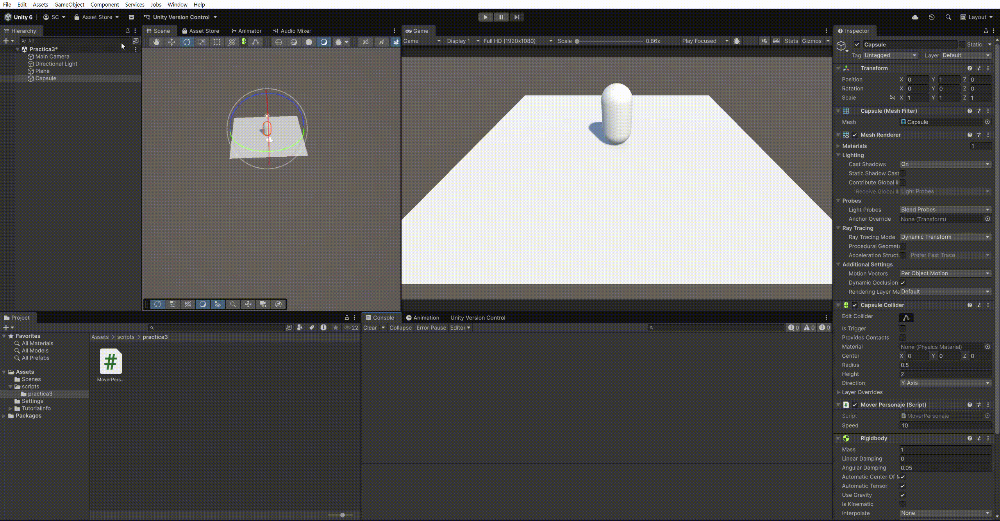

---

### Ejercicio 2

Se ha creado el script [CambiaColor.cs](src/CambiaColor.cs) para cambiar el color del cubo a uno random al colisionar con el player.

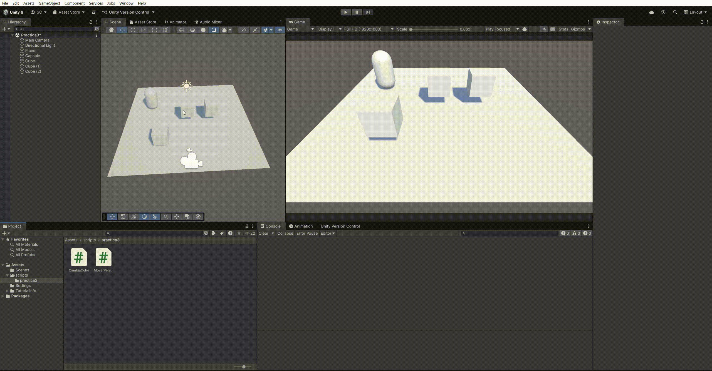

---

### Ejercicio 3

Se han creado los scripts [CuboColor.cs](src/CuboColor.cs) y [CuboDamage.cs](src/CuboDamage.cs) para cambiar el color del personaje al entrar a un área de los cubos y otro para incrementar un contador de daño.

---

### Ejercicio 4

Se ha modificado la matríz de colisión de capas para que los recoletables no colisionen con otros objetos, y los enemigos solo colisionen con el player.

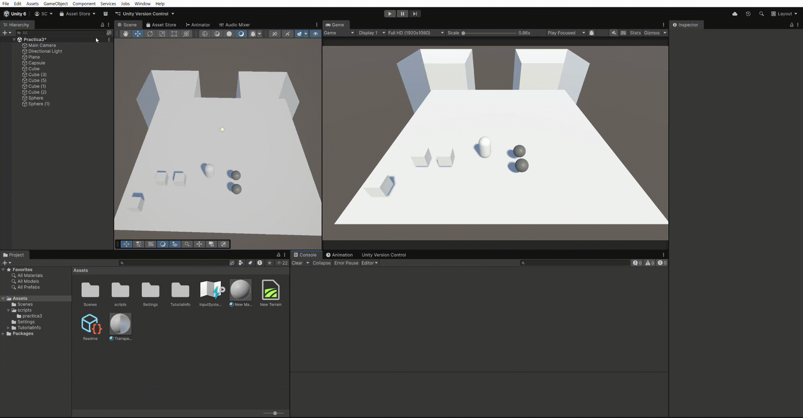

---

### Ejercicio 5

Se han creado 3 materiales físicos, hielo (0.1 de fricción), rugoso (1 de fricción) y rebote (1 de rebote). También se ha creado el script [AddForceBola.cs](src/AddForceBola.cs) para añadir una fuerza a la esfera al pulsar la tecla X.

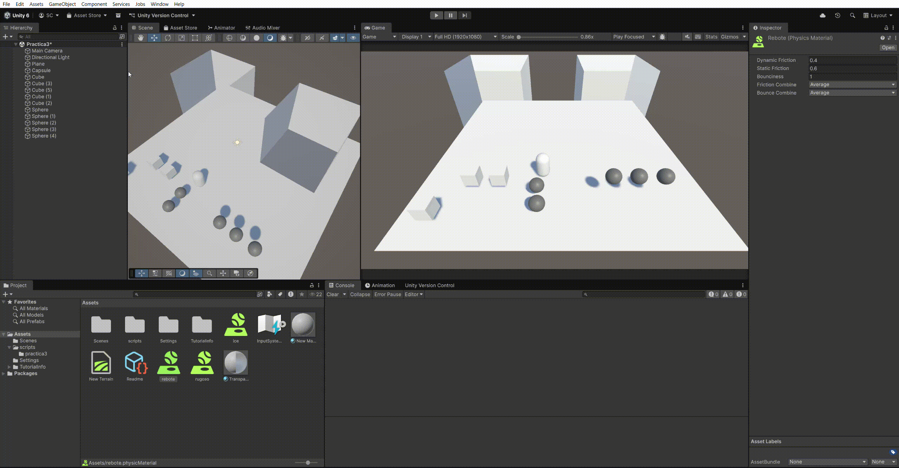
