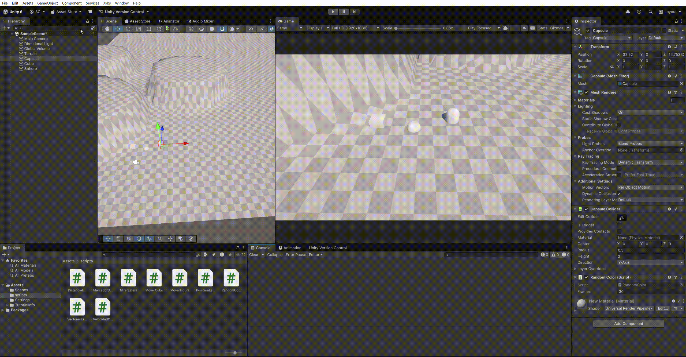
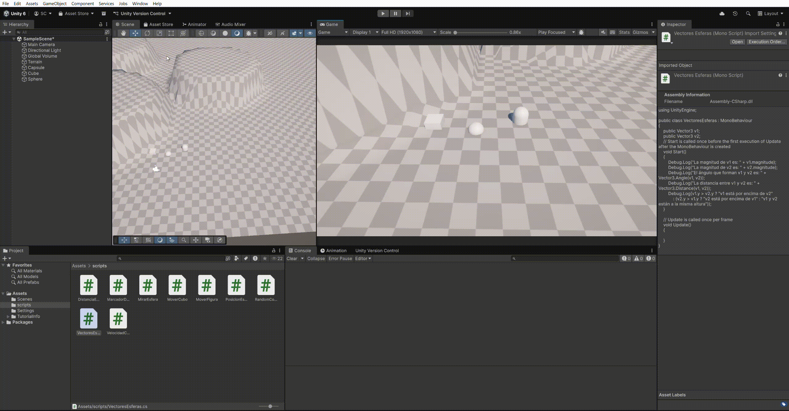
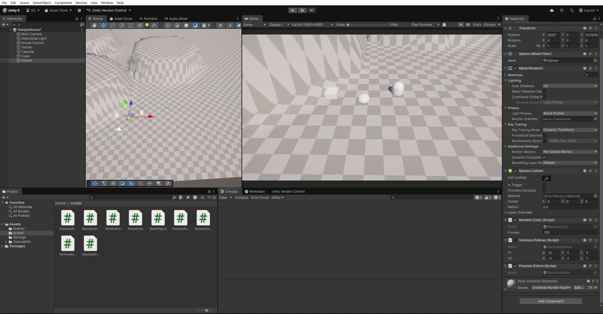
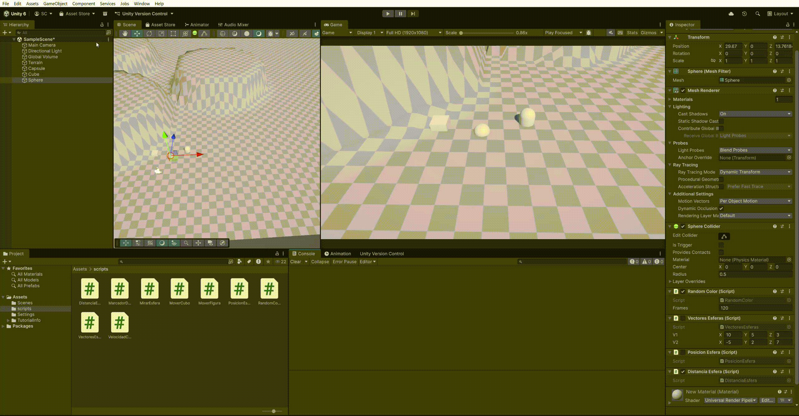
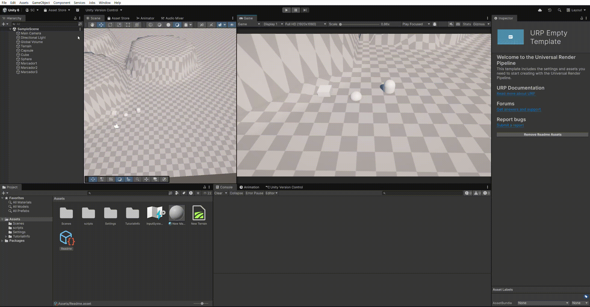
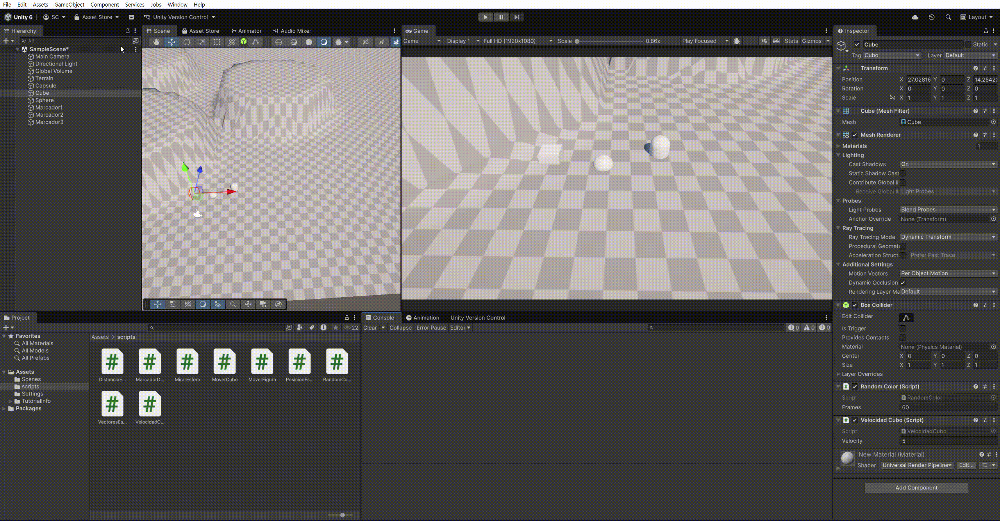
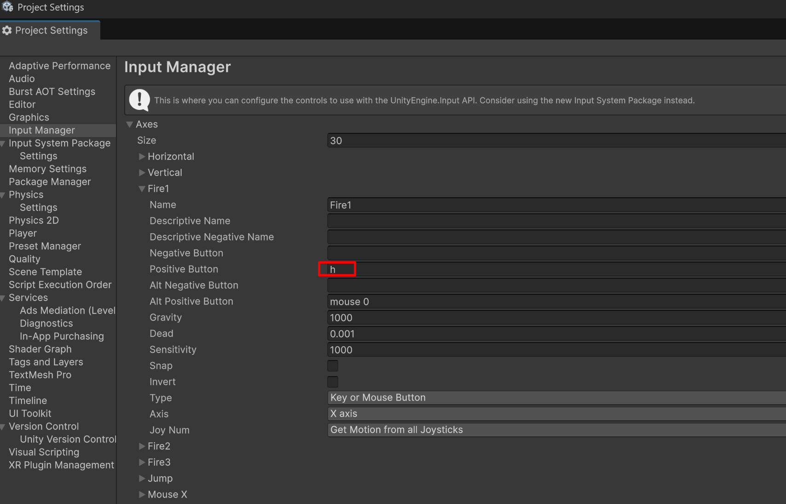
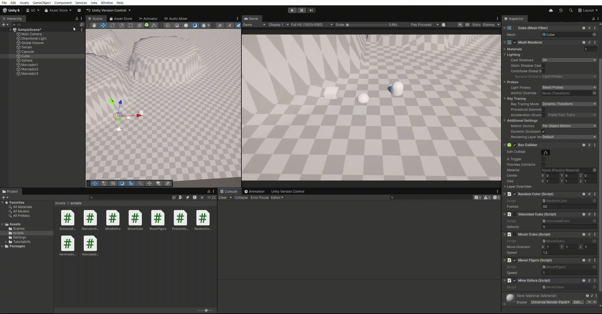

# Práctica 2 Interfaces Inteligentes
## Curso: 2025-2026
### Salvador González Cueto

---

## Apartado 1

Se ha creado el script [RandomColor.cs](src/RandomColor.cs) para cambiar el color cada N frames, por defecto 120.

---

## Apartado 2

Se ha creado el script [VectoresEsferas.cs](src/VectoresEsferas.cs) para crear, comprobar y comparar varios valores de dos vectores.

---

## Apartado 3

Se ha creado el script [PosicionEsfera.cs](src/PosicionEsfera.cs) para mostrar por pantalla la posición de la esfera.

---

## Apartado 4

Se ha creado el script [DistanciaEsfera.cs](src/DistanciaEsfera.cs) para mostrar la distancia entre la esfera y el cubo y la capsula.

---

## Apartado 5

Se ha creado el script [MarcadorDesplazamiento.cs](src/MarcadorDesplazamiento.cs) para mostrar la nueva posición que tomaría un marcador a partir de un vector de desplazamiento al pulsar el espacio.

---

## Apartado 6

Se ha creado el script [VelocidadCubo.cs](src/VelocidadCubo.cs) para mostrar el valor de un input de entrada multiplicado por una velocidad.

---

## Apartado 7

Se ha modificado la tecla asociada al eje "Fire 1".

---

## Apartado 8

Se ha creado el script [MoverCubo.cs](src/MoverCubo.cs) para desplazar un cubo mediante un vector de desplazamiento y una velocidad.

- Si se duplica la velocidad el cubo se desplaza más rápido.
- Si se duplica el vector de desplazamiento el cubo se desplaza más rápido.
- Si la velocidad es menor que 1 el cubo se desplaza más lento.
- Si la posición y es distinta de 0 el cubo se desplaza desde un origen distinto.

---

## Apartados 9, 10 y 13

Se ha creado el script [MoverFiguras.cs](src/MoverFigura.cs) para desplazar una figura en base al input del usuario en el eje horizontal y vertical.

---

## Apartado 11 y 12

Se ha creado el script [MirarEsfera.cs](src/MirarEsfera.cs) para desplazar un cubo mientras mira a una esfera en la dirección de esta mediante un vector de desplazamiento y una velocidad.
